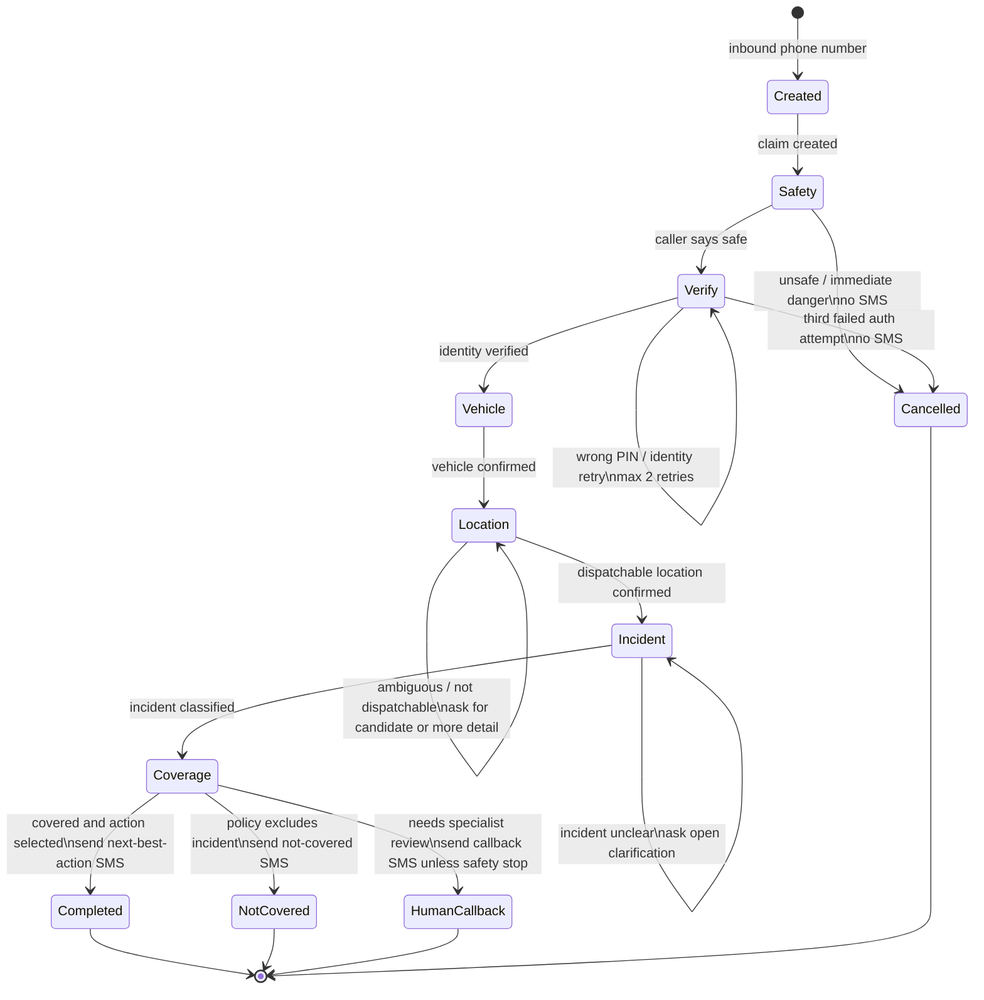

# Roadside Claim State Machine

The prototype keeps the LLM out of core workflow ownership. The Realtime agent asks questions and calls tools, but the backend decides whether the claim can move forward.

## State Diagram

## Backend-Owned Gates

| Gate | Backend source of truth | Why it exists |
|---|---|---|
| Safety | `IntakeFacts.safetyKnown` and terminal safety callback reason | Do not continue roadside intake if the caller is in traffic or immediate danger |
| Identity | PIN/identity verification endpoints | Prevent prompt injection or accidental disclosure of customer/policy data |
| Vehicle | `selectedVehicleId` and `vehicleConfirmed` | Coverage is policy/vehicle-specific |
| Location | `LocationResolution.dispatchable` and `locationConfirmed` | Avoid dispatching to vague or ambiguous locations |
| Incident | backend LLM classifier mapped to `IncidentType` enum | Keep free-form caller language while using deterministic coverage rules |
| Coverage | `CoverageDecisionService` against fake policy data | Separate policy decision from voice phrasing |
| Customer update | `smsPreview` artifact | Make post-call communication explicit and observable |

## Terminal States

| Status | Meaning | SMS behavior |
|---|---|---|
| `COMPLETED` | Covered case with next-best action selected | Send simulated next-best-action SMS |
| `NOT_COVERED` | Intake complete, but policy does not cover incident | Send simulated not-covered SMS |
| `NEEDS_HUMAN_CALLBACK` | Operational review is required | Send callback SMS, except safety-stop paths |
| `CANCELLED` | Identity/auth could not be verified | No SMS |

## Voice Agent Contract

The Realtime agent should:

- Start with safety.
- Ask one question at a time.
- Use `verify_known_pin` or `verify_unknown_identity` before revealing customer details.
- Use `record_intake_step` for exactly one completed fact at a time.
- Follow backend `nextStep` responses rather than deciding completeness itself.
- Use `end_call` only after the final caller-facing sentence is spoken.

The backend should:

- Retry auth failures twice.
- Cancel after the third failed verification attempt with no SMS.
- Return location candidates when Google Maps finds multiple plausible matches.
- Require candidate confirmation before dispatch.
- Classify incidents into a bounded enum before policy evaluation.
- Produce the final claim artifact consumed by the caller UI and observer UI.
